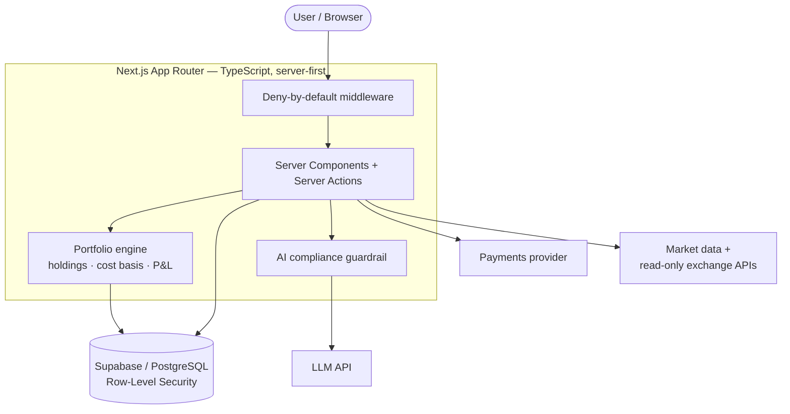

# Oxvera

**A clarity-first portfolio tracker for UK retail investors.**

Oxvera gives everyday UK investors a single, honest picture of everything they own — shares, funds, and crypto held across different brokers and exchanges — and explains it in plain English, including the parts most apps skip, like what they'll actually owe HMRC in capital-gains tax. It's a **tracker, not a trading app**: it exists to help people understand what they already hold, and by design it never tells anyone what to buy or sell.

> **This is a public showcase of a private, actively-developed project.** It contains no source code — just a description of how the system is built. The full source is private; see [Note on access](#note-on-access).

---

## Architecture

Oxvera is a full-stack TypeScript application built on the Next.js App Router. Most logic runs server-side as React Server Components and Server Actions, so sensitive work — authorisation, financial calculations, and every call to an external service — happens on the server, never in the browser.

Data lives in a Supabase-hosted PostgreSQL database, which also handles authentication. The application talks to a handful of external services: an LLM API that powers the plain-English assistant, a payments provider for subscriptions, market-data providers for prices, and read-only connections to exchange APIs so a user's holdings can be pulled in without ever granting trade access.

Two things sit at the centre of the design. A **portfolio engine** turns a user's raw transaction history into their current holdings, cost basis, and profit/loss. And a strict **request boundary** ensures every route is authenticated and every database row is owner-scoped before anything is returned.

---

## Engineering highlights

### UK Section-104 cost-basis & P&L engine
UK tax rules make cost-basis harder than it first appears. When you buy the same asset more than once, HMRC's **Section-104** rules require you to treat it as a single pooled position with an averaged cost — and when you sell, disposals must be matched against same-day and 30-day acquisitions before they touch the pool. Oxvera derives every holding, average cost, and realised/unrealised gain by replaying a user's entire transaction history through this ruleset, *rebuilding from the ledger* rather than mutating running totals, so the figures can't quietly drift out of sync over time. Exchange rates are captured at each transaction's date so historical gains stay correct no matter what rates do later. This is the part of the system that most has to be *right*, and it's the most heavily tested.

### Security model
Financial data warrants defence in depth, so authorisation is enforced at the database layer, not just in application code. Every table uses PostgreSQL **row-level security**, meaning a user can only ever reach their own rows — even a mistake in the application can't hand back someone else's data. Any connected exchange API keys are **encrypted at rest** and only ever used read-only. Accounts are protected with **TOTP two-factor authentication**, and the request layer is **deny-by-default**: routes are closed unless explicitly opened. The consistent principle is *least privilege, fail closed* — when a situation is ambiguous, the system denies rather than allows.

### AI portfolio assistant with compliance guardrails
The assistant explains a user's own portfolio in plain English — how it's allocated, what's driving performance, what a tax figure means. Because Oxvera is a tracker and not a regulated financial adviser, there's one thing it must never do: recommend a trade. That guarantee isn't left to the model's goodwill — **every response passes through a deterministic compliance layer before it reaches the user**, and the whole product is designed so the assistant *describes and explains* rather than advises. The interesting problem here is making an LLM genuinely useful about someone's real money while keeping a hard, model-independent boundary around what it's allowed to say — and defending that boundary against user-supplied content that might try to subvert it.

### Testing & quality
Correctness in a money app isn't optional, so the project carries **800+ automated tests** across unit, integration, and Playwright end-to-end coverage. The suite deliberately concentrates on the two places a bug would hurt most: the **financial calculations** (proving the cost-basis and P&L maths against known scenarios) and **data isolation** (tests that sign in as one user and confirm they cannot reach another user's data). Every change runs through a **CI pipeline** — lint, type-check, and database/isolation tests — before it can merge, and the codebase has had dedicated **accessibility (WCAG AA)** and security-hardening passes.

---

## Tech stack

**Frontend** — Next.js (App Router) · React (Server Components + Server Actions) · TypeScript · Tailwind CSS · shadcn/ui

**Backend & data** — Supabase · PostgreSQL (with row-level security) · Node.js / TypeScript

**AI** — LLM API, wrapped in a deterministic compliance guardrail

**Payments** — Stripe subscriptions

**Testing** — Vitest (unit/integration) · Playwright (end-to-end) · CI (lint, type-check, database/isolation tests)

**Infrastructure** — Vercel

---

## Screenshots

---

## Note on access

Oxvera is a private, actively-developed project, and this repository is a showcase of the engineering rather than the source itself. The code is kept private to protect work in progress; I'm happy to walk through the architecture in detail or grant read-only access to the real repository for an interview.
